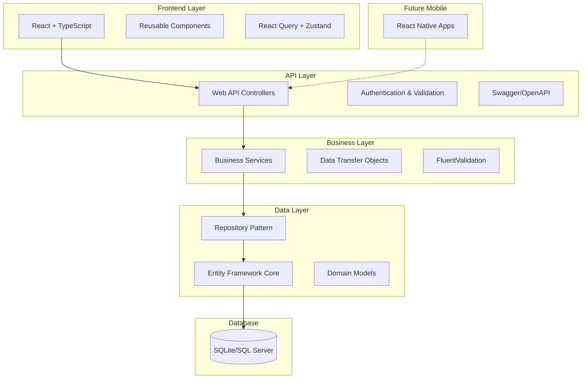
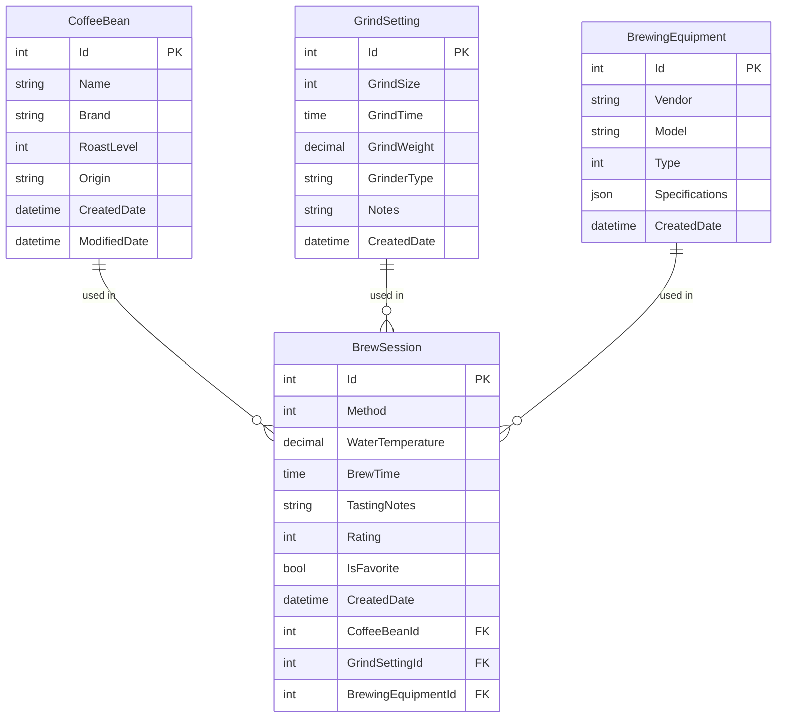

# Design Document

## Overview

BrewLog is a full-stack coffee tracking application built with .NET 8 Web API backend and a modern frontend (Blazor or React). The system follows clean architecture principles with clear separation of concerns, using Entity Framework Core for data persistence and providing RESTful APIs for frontend consumption.

The application enables coffee enthusiasts to track their complete brewing workflow - from bean inventory management through equipment tracking to detailed brew session logging and analytics.

## Architecture

### High-Level Architecture



### Technology Stack

**Backend:**
- .NET 8 Web API
- Entity Framework Core 8
- SQLite (development) / SQL Server (production)
- AutoMapper for DTO mapping
- FluentValidation for input validation
- Swagger/OpenAPI for documentation

**Frontend:**
- **React.js with TypeScript** for modern SPA experience and mobile app compatibility
- **Future Mobile Apps:** React Native for iOS/Android app store deployment with shared codebase

## Components and Interfaces

### Core Domain Models

```csharp
// Coffee Bean Entity
public class CoffeeBean
{
    public int Id { get; set; }
    public string Name { get; set; }
    public string Brand { get; set; }
    public RoastLevel RoastLevel { get; set; }
    public string Origin { get; set; }
    public DateTime CreatedDate { get; set; }
    public DateTime? ModifiedDate { get; set; }
    
    // Navigation properties
    public ICollection<BrewSession> BrewSessions { get; set; }
}

// Grind Setting Entity
public class GrindSetting
{
    public int Id { get; set; }
    public int GrindSize { get; set; } // 1-30 scale
    public TimeSpan GrindTime { get; set; }
    public decimal GrindWeight { get; set; } // in grams
    public string GrinderType { get; set; }
    public string Notes { get; set; }
    public DateTime CreatedDate { get; set; }
    
    // Navigation properties
    public ICollection<BrewSession> BrewSessions { get; set; }
}

// Equipment Entity
public class BrewingEquipment
{
    public int Id { get; set; }
    public string Vendor { get; set; }
    public string Model { get; set; }
    public EquipmentType Type { get; set; }
    public Dictionary<string, string> Specifications { get; set; } // JSON column
    public DateTime CreatedDate { get; set; }
    
    // Navigation properties
    public ICollection<BrewSession> BrewSessions { get; set; }
}

// Brew Session Entity
public class BrewSession
{
    public int Id { get; set; }
    public BrewMethod Method { get; set; }
    public decimal WaterTemperature { get; set; }
    public TimeSpan BrewTime { get; set; }
    public string TastingNotes { get; set; }
    public int? Rating { get; set; } // 1-10 scale
    public bool IsFavorite { get; set; }
    public DateTime CreatedDate { get; set; }
    
    // Foreign Keys
    public int CoffeeBeanId { get; set; }
    public int GrindSettingId { get; set; }
    public int? BrewingEquipmentId { get; set; }
    
    // Navigation properties
    public CoffeeBean CoffeeBean { get; set; }
    public GrindSetting GrindSetting { get; set; }
    public BrewingEquipment BrewingEquipment { get; set; }
}
```

### Enumerations

```csharp
public enum RoastLevel
{
    Light,
    MediumLight,
    Medium,
    MediumDark,
    Dark
}

public enum BrewMethod
{
    Espresso,
    FrenchPress,
    PourOver,
    Drip,
    AeroPress,
    ColdBrew
}

public enum EquipmentType
{
    EspressoMachine,
    Grinder,
    FrenchPress,
    PourOverSetup,
    DripMachine,
    AeroPress
}
```

### API Controllers

**CoffeeBeansController**
- `GET /api/coffeebeans` - List all beans with filtering
- `GET /api/coffeebeans/{id}` - Get specific bean
- `POST /api/coffeebeans` - Create new bean
- `PUT /api/coffeebeans/{id}` - Update bean
- `DELETE /api/coffeebeans/{id}` - Delete bean

**GrindSettingsController**
- `GET /api/grindsettings` - List grind settings with filtering
- `GET /api/grindsettings/{id}` - Get specific setting
- `POST /api/grindsettings` - Create new setting
- `PUT /api/grindsettings/{id}` - Update setting
- `DELETE /api/grindsettings/{id}` - Delete setting

**EquipmentController**
- `GET /api/equipment` - List all equipment
- `GET /api/equipment/{id}` - Get specific equipment
- `POST /api/equipment` - Create new equipment
- `PUT /api/equipment/{id}` - Update equipment
- `DELETE /api/equipment/{id}` - Delete equipment

**BrewSessionsController**
- `GET /api/brewsessions` - List sessions with advanced filtering
- `GET /api/brewsessions/{id}` - Get specific session
- `POST /api/brewsessions` - Create new session
- `PUT /api/brewsessions/{id}` - Update session
- `DELETE /api/brewsessions/{id}` - Delete session
- `POST /api/brewsessions/{id}/favorite` - Toggle favorite status

**AnalyticsController**
- `GET /api/analytics/dashboard` - Dashboard statistics
- `GET /api/analytics/correlations` - Grind size vs rating correlations
- `GET /api/analytics/recommendations` - Personalized recommendations
- `GET /api/analytics/equipment-performance` - Equipment performance metrics

### Service Layer Interfaces

```csharp
public interface ICoffeeBeanService
{
    Task<IEnumerable<CoffeeBeanDto>> GetAllAsync(CoffeeBeanFilter filter);
    Task<CoffeeBeanDto> GetByIdAsync(int id);
    Task<CoffeeBeanDto> CreateAsync(CreateCoffeeBeanDto dto);
    Task<CoffeeBeanDto> UpdateAsync(int id, UpdateCoffeeBeanDto dto);
    Task DeleteAsync(int id);
}

public interface IBrewSessionService
{
    Task<IEnumerable<BrewSessionDto>> GetAllAsync(BrewSessionFilter filter);
    Task<BrewSessionDto> GetByIdAsync(int id);
    Task<BrewSessionDto> CreateAsync(CreateBrewSessionDto dto);
    Task<BrewSessionDto> UpdateAsync(int id, UpdateBrewSessionDto dto);
    Task DeleteAsync(int id);
    Task<BrewSessionDto> ToggleFavoriteAsync(int id);
}

public interface IAnalyticsService
{
    Task<DashboardStatsDto> GetDashboardStatsAsync();
    Task<CorrelationAnalysisDto> GetCorrelationAnalysisAsync();
    Task<IEnumerable<RecommendationDto>> GetRecommendationsAsync();
    Task<EquipmentPerformanceDto> GetEquipmentPerformanceAsync();
}
```

## Data Models

### Database Schema Design



### Entity Framework Configuration

```csharp
public class BrewLogDbContext : DbContext
{
    public DbSet<CoffeeBean> CoffeeBeans { get; set; }
    public DbSet<GrindSetting> GrindSettings { get; set; }
    public DbSet<BrewingEquipment> BrewingEquipment { get; set; }
    public DbSet<BrewSession> BrewSessions { get; set; }
    
    protected override void OnModelCreating(ModelBuilder modelBuilder)
    {
        // Configure JSON column for equipment specifications
        modelBuilder.Entity<BrewingEquipment>()
            .Property(e => e.Specifications)
            .HasConversion(
                v => JsonSerializer.Serialize(v, (JsonSerializerOptions)null),
                v => JsonSerializer.Deserialize<Dictionary<string, string>>(v, (JsonSerializerOptions)null));
        
        // Configure decimal precision
        modelBuilder.Entity<BrewSession>()
            .Property(b => b.WaterTemperature)
            .HasPrecision(5, 2);
            
        modelBuilder.Entity<GrindSetting>()
            .Property(g => g.GrindWeight)
            .HasPrecision(6, 2);
        
        // Configure relationships
        modelBuilder.Entity<BrewSession>()
            .HasOne(b => b.CoffeeBean)
            .WithMany(c => c.BrewSessions)
            .HasForeignKey(b => b.CoffeeBeanId)
            .OnDelete(DeleteBehavior.Restrict);
    }
}
```

## Error Handling

### Global Exception Handling

```csharp
public class GlobalExceptionMiddleware
{
    public async Task InvokeAsync(HttpContext context, RequestDelegate next)
    {
        try
        {
            await next(context);
        }
        catch (ValidationException ex)
        {
            await HandleValidationExceptionAsync(context, ex);
        }
        catch (NotFoundException ex)
        {
            await HandleNotFoundExceptionAsync(context, ex);
        }
        catch (Exception ex)
        {
            await HandleGenericExceptionAsync(context, ex);
        }
    }
}
```

### Validation Strategy

- **FluentValidation** for complex business rule validation
- **Data Annotations** for simple property validation
- **Custom validators** for cross-entity validation rules

### Error Response Format

```json
{
    "error": {
        "code": "VALIDATION_ERROR",
        "message": "One or more validation errors occurred",
        "details": [
            {
                "field": "GrindSize",
                "message": "Grind size must be between 1 and 30"
            }
        ]
    }
}
```

## Testing Strategy

### Unit Testing

- **xUnit** as testing framework
- **Moq** for mocking dependencies
- **FluentAssertions** for readable assertions
- **AutoFixture** for test data generation

**Test Coverage Areas:**
- Service layer business logic
- Validation rules
- Entity mappings
- Repository patterns

### Integration Testing

- **ASP.NET Core Test Host** for API testing
- **In-memory database** for data layer testing
- **WebApplicationFactory** for full integration tests

**Integration Test Scenarios:**
- Complete CRUD operations through API
- Complex filtering and querying
- Analytics calculations
- Data consistency across operations

### Frontend Testing (if React)

- **Jest** and **React Testing Library** for component testing
- **Cypress** for end-to-end testing
- **MSW (Mock Service Worker)** for API mocking

### Frontend Testing (if Blazor)

- **bUnit** for Blazor component testing
- **Playwright** for end-to-end testing
- **WireMock.NET** for API mocking

### Performance Testing

- **NBomber** for load testing API endpoints
- **Entity Framework** query performance monitoring
- **Application Insights** for production monitoring

## Frontend Architecture (React Option)

### Component Structure

```
src/
├── components/
│   ├── common/
│   │   ├── Layout.tsx
│   │   ├── Navigation.tsx
│   │   └── LoadingSpinner.tsx
│   ├── beans/
│   │   ├── BeanList.tsx
│   │   ├── BeanForm.tsx
│   │   └── BeanCard.tsx
│   ├── grind/
│   │   ├── GrindSettingsList.tsx
│   │   └── GrindSettingsForm.tsx
│   ├── equipment/
│   │   ├── EquipmentList.tsx
│   │   └── EquipmentForm.tsx
│   ├── sessions/
│   │   ├── BrewSessionList.tsx
│   │   ├── BrewSessionForm.tsx
│   │   └── BrewSessionCard.tsx
│   └── analytics/
│       ├── Dashboard.tsx
│       ├── CorrelationChart.tsx
│       └── RecommendationPanel.tsx
├── hooks/
│   ├── useApi.ts
│   ├── useCoffeeBeans.ts
│   └── useBrewSessions.ts
├── services/
│   ├── api.ts
│   ├── coffeeBeansService.ts
│   └── brewSessionsService.ts
└── types/
    ├── CoffeeBean.ts
    ├── BrewSession.ts
    └── ApiResponse.ts
```

### State Management

- **React Query (TanStack Query)** for server state management
- **Zustand** for client-side state management
- **React Hook Form** for form state management

## Mobile App Considerations (Future React Native)

### Shared Architecture Benefits

- **Shared TypeScript types** between web and mobile
- **Common API service layer** for consistent data access
- **Reusable business logic** and validation rules
- **Consistent state management** patterns

### Mobile-Specific Features

- **Offline-first** brew session creation with sync
- **Camera integration** for bean photos and QR codes
- **Timer integration** for brew timing with notifications
- **Location services** for coffee shop tracking
- **Push notifications** for brew reminders

### React Native Structure (Future)

```
mobile/
├── src/
│   ├── components/
│   │   ├── common/
│   │   ├── beans/
│   │   ├── sessions/
│   │   └── analytics/
│   ├── screens/
│   │   ├── BeansScreen.tsx
│   │   ├── BrewSessionScreen.tsx
│   │   └── DashboardScreen.tsx
│   ├── services/
│   │   └── api/ (shared with web)
│   ├── hooks/
│   │   └── (shared with web)
│   └── types/
│       └── (shared with web)
```